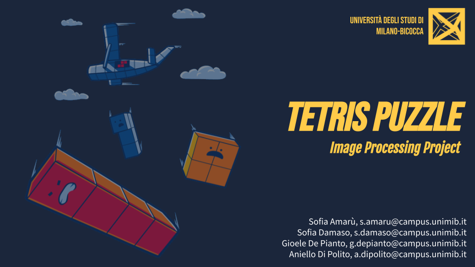
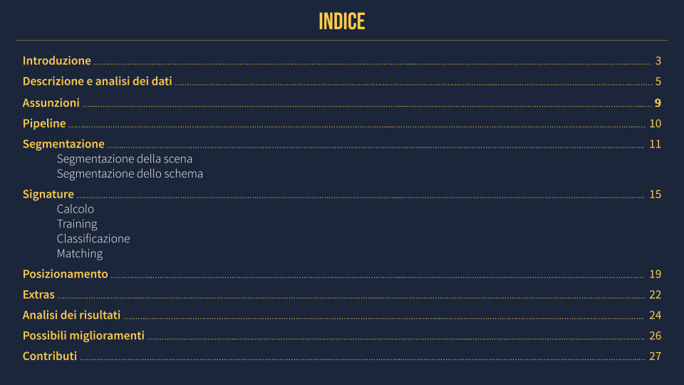
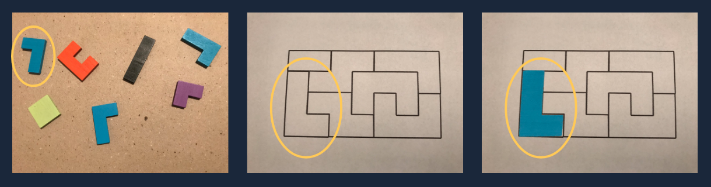

# Tetris Puzzle





## Introduzione

Nel gioco Tetris Puzzle vi sono diverse figure geometriche chiamate tetramini che possono essere combinate fra loro. L’obiettivo del gioco (e del nostro applicativo) è comporre uno schema senza buchi a partire da un'immagine di scena e un'immagine di schema:



## Funzionamento

Per avviare l’applicazione, eseguire la funzione `tetris_puzzle.m` inserendo come input l'immagine di scena e l'immagine dello schema, ad esempio:

```matlab
>> tetris_puzzle(imread('scene/P03.jpg'),imread('scheme/S03.jpg'));
```

## La presentazione
La presentazione del progetto si può scaricare cliccando [qui](https://github.com/gdepianto/progetto_elaborazioni_immagini/raw/main/Tetris%20Puzzle.pdf).
